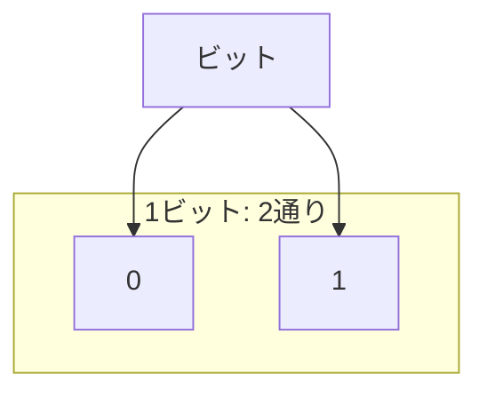
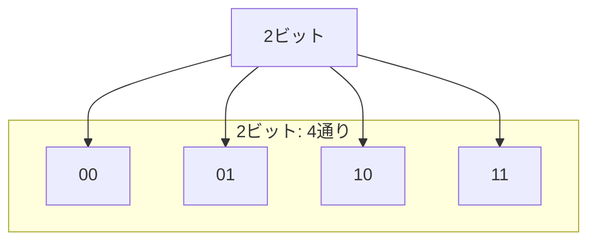
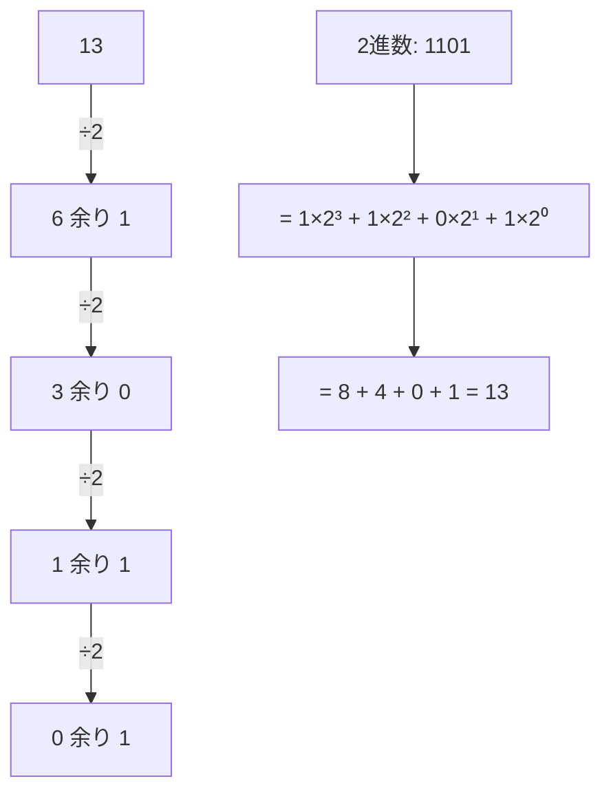
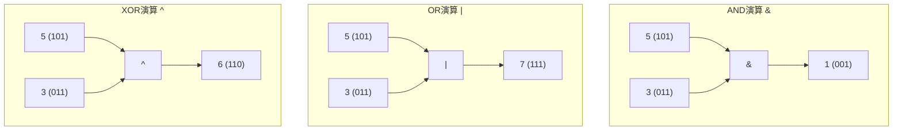
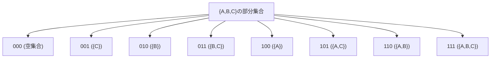
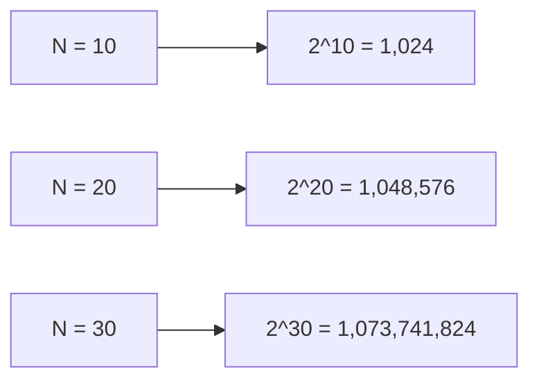

# 03補足_bit全探索入門

## プログラミング初心者のためのbit全探索

この教材はbitやビット演算について全く知識がない方向けに、基礎から丁寧に解説していきます。

## 目次

1. [ビット（bit）とは何か](#1-ビットbitとは何か)
2. [2進数の基礎](#2-2進数の基礎)
3. [ビット演算の基本](#3-ビット演算の基本)
4. [bit全探索とは](#4-bit全探索とは)
5. [bit全探索の実装方法](#5-bit全探索の実装方法)
6. [具体的な問題の解き方](#6-具体的な問題の解き方)
7. [超初心者向け: より具体的なbit全探索の解説](#7-超初心者向け-より具体的なbit全探索の解説)
8. [練習問題](#8-練習問題)
9. [まとめ](#まとめ)

---

## 1. ビット（bit）とは何か

### ビットの基礎知識

ビット (bit) とは、コンピュータにおける最小の情報単位で、0か1の値を取ります。コンピュータの中では、全ての情報がこの0と1の組み合わせで表現されています。

例えば：
- 1ビット → 0か1のどちらか（2通り）
- 2ビット → 00, 01, 10, 11 （4通り）
- 3ビット → 000, 001, 010, 011, 100, 101, 110, 111 （8通り）

nビットでは、2^n通りの表現が可能です。





---

## 2. 2進数の基礎

### 10進数と2進数

普段私たちが使う数字は10進数ですが、コンピュータの内部では2進数が使われています。

#### 10進数から2進数への変換：
- 10進数を2で割り続け、その余りを下から順に並べる

例：10進数の「13」を2進数に変換する
1. 13 ÷ 2 = 6 余り 1
2. 6 ÷ 2 = 3 余り 0
3. 3 ÷ 2 = 1 余り 1
4. 1 ÷ 2 = 0 余り 1
5. → 下から順に読むと「1101」になる

つまり、13(10進数) = 1101(2進数) となります。



### Pythonで2進数を扱う

Pythonで10進数から2進数に変換する方法：

```python
def decimal_to_binary(n):
    """10進数を2進数の文字列に変換する"""
    return bin(n)[2:]  # bin()は'0b'で始まるので、それを取り除く

# 1から15までの数値の2進数表記
for i in range(1, 16):
    print(f"{i}(10進数) = {decimal_to_binary(i)}(2進数)")
```

実行結果:
```
1(10進数) = 1(2進数)
2(10進数) = 10(2進数)
3(10進数) = 11(2進数)
4(10進数) = 100(2進数)
5(10進数) = 101(2進数)
6(10進数) = 110(2進数)
...
15(10進数) = 1111(2進数)
```

### 2進数の桁の呼び方

2進数の各桁は、右から「0桁目、1桁目、2桁目...」と呼びます。

例えば、2進数の「1101」の場合：
- 0桁目は 1
- 1桁目は 0
- 2桁目は 1
- 3桁目は 1

各桁は2のn乗の重みを持ちます：

1101 = 1×2^3 + 1×2^2 + 0×2^1 + 1×2^0 = 8 + 4 + 0 + 1 = 13

```
  1    1    0    1  ← ビットの値
  |    |    |    |
  |    |    |    └── 2⁰ = 1
  |    |    └─────── 2¹ = 2
  |    └──────────── 2² = 4
  └─────────────────── 2³ = 8
```

---

## 3. ビット演算の基本

### ビット演算子

Pythonでは以下のビット演算子が使えます：

1. **& (AND)**: 両方のビットが1の場合に1、それ以外は0
   ```
   例：5 & 3 = 101(2進) & 011(2進) = 001(2進) = 1(10進)
   ```

2. **| (OR)**: どちらかのビットが1の場合に1、両方0の場合は0
   ```
   例：5 | 3 = 101(2進) | 011(2進) = 111(2進) = 7(10進)
   ```

3. **^ (XOR)**: ビットが異なる場合に1、同じ場合は0
   ```
   例：5 ^ 3 = 101(2進) ^ 011(2進) = 110(2進) = 6(10進)
   ```

4. **~ (NOT)**: ビットを反転（1→0, 0→1）
   ```
   例：~5 = ~(101)(2進) = ...11111010(2進) = -6(10進)
   ```
   ※ Pythonでは負の数は2の補数表現が使われるため、結果が直感と異なる場合があります

5. **<< (左シフト)**: ビットを左にずらす
   ```
   例：5 << 1 = 101(2進) << 1 = 1010(2進) = 10(10進)
   ```
   ※ n << m は、nを2^m倍することと同じ

6. **>> (右シフト)**: ビットを右にずらす
   ```
   例：5 >> 1 = 101(2進) >> 1 = 10(2進) = 2(10進)
   ```
   ※ n >> m は、nを2^mで割った整数部分と同じ

### ビット演算の視覚化



### Pythonでのビット演算例

```python
a = 5  # 101(2進)
b = 3  # 011(2進)

print(f"{a} & {b} = {a & b}, 2進数では {bin(a)[2:]} & {bin(b)[2:]} = {bin(a & b)[2:]}")
print(f"{a} | {b} = {a | b}, 2進数では {bin(a)[2:]} | {bin(b)[2:]} = {bin(a | b)[2:]}")
print(f"{a} ^ {b} = {a ^ b}, 2進数では {bin(a)[2:]} ^ {bin(b)[2:]} = {bin(a ^ b)[2:]}")
print(f"{a} << 1 = {a << 1}, 2進数では {bin(a)[2:]} << 1 = {bin(a << 1)[2:]}")
print(f"{a} >> 1 = {a >> 1}, 2進数では {bin(a)[2:]} >> 1 = {bin(a >> 1)[2:]}")
```

実行結果:
```
5 & 3 = 1, 2進数では 101 & 11 = 1
5 | 3 = 7, 2進数では 101 | 11 = 111
5 ^ 3 = 6, 2進数では 101 ^ 11 = 110
5 << 1 = 10, 2進数では 101 << 1 = 1010
5 >> 1 = 2, 2進数では 101 >> 1 = 10
```

### ビット演算の重要ポイント

bit全探索で特に重要なのは以下の操作です：

1. **i番目のビットが1かどうかを確認する**: 
   ```python
   (x & (1 << i)) != 0
   ```
   
   例：数値5(101)の1桁目が1かどうか
   ```
   5 & (1 << 1) = 101 & 010 = 000 → 0（1桁目は0）
   ```
   
   例：数値5(101)の0桁目が1かどうか
   ```
   5 & (1 << 0) = 101 & 001 = 001 → 1（0桁目は1）
   ```

2. **2のn乗を計算する**: 
   ```python
   (1 << n)
   ```
   
   例：2^3を計算する
   ```
   1 << 3 = 1000(2進) = 8(10進)
   ```

---

## 4. bit全探索とは

### bit全探索の概念

bit全探索とは、N個の要素から「選ぶ・選ばない」の全ての組み合わせを効率的に列挙する手法です。

例えば、{A, B, C}という3つの要素から、どの要素を選ぶかを考えるとき：
- 何も選ばない: {}
- Aだけ選ぶ: {A}
- Bだけ選ぶ: {B}
- Cだけ選ぶ: {C}
- AとBを選ぶ: {A, B}
- AとCを選ぶ: {A, C}
- BとCを選ぶ: {B, C}
- 全部選ぶ: {A, B, C}

この8通りの組み合わせは、3ビットの全ての値（000から111まで）で表現できます：

```
ビット値  2進数  選ぶ要素
------  -----  ------
   0    000    {}      (何も選ばない)
   1    001    {C}     (3番目の要素)
   2    010    {B}     (2番目の要素)
   3    011    {B,C}   (2,3番目の要素)
   4    100    {A}     (1番目の要素)
   5    101    {A,C}   (1,3番目の要素)
   6    110    {A,B}   (1,2番目の要素)
   7    111    {A,B,C} (全て選ぶ)
```



一般的に、N個の要素からなる集合の部分集合は2^N通りあり、これをビットで表現することで、全ての組み合わせを効率的に列挙できます。

---

## 5. bit全探索の実装方法

### bit全探索のPython実装

Pythonでbit全探索を行う基本的なパターンは以下の通りです：

1. 0から2^N-1までの数値を列挙する（これは全ての部分集合を表す）
2. 各数値について、どのビットが立っているか（=どの要素を選ぶか）を確認する
3. 選んだ要素に対して必要な処理を行う

```python
def basic_bit_search(elements):
    """要素のリストに対して、全ての部分集合を列挙する"""
    n = len(elements)
    
    print(f"{elements}の全ての部分集合:")
    
    # 0から2^n-1までループ
    for bit in range(1 << n):
        subset = []
        # 各ビットをチェック
        for i in range(n):
            # i番目のビットが立っているかチェック
            if bit & (1 << i):
                subset.append(elements[i])
        
        # 部分集合と、それに対応する2進数表記を表示
        binary = bin(bit)[2:].zfill(n)
        print(f"部分集合: {subset}, ビット: {binary}")
```

実行例:

```python
# 例として、文字のリストに対してbit全探索を行う
basic_bit_search(['A', 'B', 'C'])
```

実行結果:
```
['A', 'B', 'C']の全ての部分集合:
部分集合: [], ビット: 000
部分集合: ['C'], ビット: 001
部分集合: ['B'], ビット: 010
部分集合: ['B', 'C'], ビット: 011
部分集合: ['A'], ビット: 100
部分集合: ['A', 'C'], ビット: 101
部分集合: ['A', 'B'], ビット: 110
部分集合: ['A', 'B', 'C'], ビット: 111
```

### ビット演算の便利なテクニック

1. **ビットカウント**: ビットの立っている数（1の数）をカウント
   ```python
   bin(n).count('1')
   ```
   
2. **最下位ビットを取得**: 最も右側の立っているビット
   ```python
   n & -n
   ```

---

## 6. 具体的な問題の解き方

### ボールの選択問題

先ほどのボールの問題を具体例に解説します：

#### 問題:
N個のボールがあり、i番目のボールの重さはW_iです。
1つ以上のボールを選び、その重さの合計がちょうどXとなるような選び方が存在するか判定する。

#### アプローチ:
1. 各ボールを「選ぶ」か「選ばない」かの2通りがあるので、全体で2^N通りの組み合わせがある
2. bit全探索で全ての組み合わせを試し、重さの合計がXになるかチェックする

```python
def solve_ball_selection(n, x, weights):
    """
    n個のボールから選んで、重さの合計がxとなるような選び方があるか判定する
    
    Args:
        n: ボールの数
        x: 目標の重さ
        weights: 各ボールの重さのリスト
    
    Returns:
        bool: 選び方が存在すればTrue、存在しなければFalse
    """
    # 1から2^n-1までループ（少なくとも1つは選ぶ）
    for bit in range(1, 1 << n):
        total = 0
        selected = []
        
        # 各ビットをチェック
        for i in range(n):
            # i番目のビットが立っているかチェック（=i番目のボールを選ぶか）
            if bit & (1 << i):
                total += weights[i]
                selected.append(weights[i])
        
        # 合計がxと一致するかチェック
        if total == x:
            print(f"解答: 選ぶボール {selected}, 合計: {total}")
            return True
    
    return False
```

実行例:

```python
# 例として、問題の例を解いてみる
n = 5
x = 12
weights = [7, 5, 3, 1, 8]
result = solve_ball_selection(n, x, weights)
print(f"選び方が存在する: {result}")

# 別の例
n = 3
x = 21
weights = [6, 2, 3]
result = solve_ball_selection(n, x, weights)
print(f"選び方が存在する: {result}")
```

実行結果:
```
解答: 選ぶボール [3, 1, 8], 合計: 12
選び方が存在する: True

選び方が存在する: False
```

処理の流れを視覚化すると:

```mermaid
graph TD
    A[ボールの重さ: [7, 5, 3, 1, 8], 目標: 12] --> B["bit = 1 (00001)"]
    B --> C["選択: [8], 合計: 8 != 12"]
    C --> D["bit = 2 (00010)"]
    D --> E["選択: [1], 合計: 1 != 12"]
    E --> F["..."]
    F --> G["bit = 19 (10011)"]
    G --> H["選択: [3, 1, 8], 合計: 12 == 12"]
    H --> I["解が見つかった！"]
```

---

## 7. 超初心者向け: より具体的なbit全探索の解説

### 「ボールを選ぶ」という操作をビットで表す

bit全探索がどのように動くのか、具体例でさらに詳しく説明します。「bitの理屈」をわかりやすく理解するために、日常的な例で考えてみましょう。

#### 例：お菓子の詰め合わせを考える

あなたは3種類のお菓子（チョコ、クッキー、キャンディ）から、「入れる・入れない」を選んで詰め合わせを作ります。全部で何通りの組み合わせがあるでしょうか？

- 何も入れない
- チョコだけ
- クッキーだけ
- キャンディだけ
- チョコとクッキー
- チョコとキャンディ
- クッキーとキャンディ
- 全部入れる

合計8通り（= 2³）の組み合わせができます。

### bitを使った考え方

3種類のお菓子を3桁の2進数で表現してみましょう：

```
チョコ クッキー キャンディ
  │      │      │
  ↓      ↓      ↓
  1      0      1    → 「チョコとキャンディを選ぶ」
```

「1」が「選ぶ」を表し、「0」が「選ばない」を表します。

すると、全ての組み合わせは次のように表せます：

| 10進数 | 2進数 | チョコ | クッキー | キャンディ | 詰め合わせ内容 |
|--------|-------|--------|----------|------------|----------------|
| 0      | 000   | ×     | ×       | ×         | 空（何も入れない） |
| 1      | 001   | ×     | ×       | ○         | キャンディのみ |
| 2      | 010   | ×     | ○       | ×         | クッキーのみ |
| 3      | 011   | ×     | ○       | ○         | クッキー＋キャンディ |
| 4      | 100   | ○     | ×       | ×         | チョコのみ |
| 5      | 101   | ○     | ×       | ○         | チョコ＋キャンディ |
| 6      | 110   | ○     | ○       | ×         | チョコ＋クッキー |
| 7      | 111   | ○     | ○       | ○         | 全部入り |

### 数値とビットの対応を視覚的に理解する

10進数「5」を2進数で表すと「101」になります：

```
      1     0     1
      │     │     │
      │     │     │
      ↓     ↓     ↓
 2の2乗  2の1乗  2の0乗
   4      2      1
      │     │     │
      │     │     │
      ↓     ↓     ↓
      4  +  0  +  1  = 5
```

このとき、「5」という数値は「チョコとキャンディを選び、クッキーを選ばない」という選択を表しています。

### `bit & (1 << i)` の直感的な理解

`bit & (1 << i)` というコードは「bit変数の中のi番目のビットが1（選ぶ）かどうか」をチェックしています。

例えば `bit = 5`（2進数で101）のとき：

```
i = 0 の場合：
    1 << 0 = 001
    bit & (1 << 0) = 101 & 001 = 001 （0でない値 → 0番目のビットは1）
    → キャンディを選ぶ

i = 1 の場合：
    1 << 1 = 010
    bit & (1 << 1) = 101 & 010 = 000 （0 → 1番目のビットは0）
    → クッキーを選ばない

i = 2 の場合：
    1 << 2 = 100
    bit & (1 << 2) = 101 & 100 = 100 （0でない値 → 2番目のビットは1）
    → チョコを選ぶ
```

### bit全探索のステップバイステップ解説

ボールの重さ問題で考えてみましょう（N=3, weights=[10, 20, 30], X=40）:

```python
def solve_example():
    N = 3  # ボールの数
    X = 40  # 目標の重さ
    weights = [10, 20, 30]  # 各ボールの重さ
    
    # bit全探索
    for bit in range(1, 1 << N):  # 1から7まで
        print(f"bit = {bit} (2進数: {bin(bit)[2:].zfill(N)})")
        
        total = 0
        selected = []
        
        # 各ビットをチェック
        for i in range(N):
            if bit & (1 << i):
                total += weights[i]
                selected.append(weights[i])
                print(f"  {i}番目のビットが1なので、{weights[i]}を選びます")
        
        print(f"  選んだボール: {selected}, 合計: {total}")
        
        # 合計がXと一致するかチェック
        if total == X:
            print(f"  目標の重さ{X}と一致しました！")
        else:
            print(f"  目標の重さ{X}とは一致しません")
        print("-----")
```

実行結果（一部抜粋）:
```
bit = 5 (2進数: 101)
  0番目のビットが1なので、10を選びます
  2番目のビットが1なので、30を選びます
  選んだボール: [10, 30], 合計: 40
  目標の重さ40と一致しました！
-----
```

このように、bit = 5（2進数で101）のとき、0番目と2番目のボール（重さ10と30）を選ぶことで、合計40になります。

### なぜbit全探索が効率的なのか

単純に「全ての選び方を試す」と、N個の要素それぞれを「選ぶ・選ばない」の2通りで考えて、2^N通りの組み合わせがあります。これを手作業で列挙するのは大変ですが、bit全探索を使えば、0から2^N-1までの数値を単純にループするだけで全ての組み合わせを効率的に列挙できます。

また、ビット演算を使うことで、「どの要素を選んだか」という情報を1つの整数値で管理できるのも大きな利点です。

### 具体的な問題解決

ボールの重さ問題では、以下のように考えます：

1. N個のボールの全ての選び方（2^N通り）を試す
2. 各選び方について、選んだボールの重さの合計を計算
3. 合計が目標の重さXと一致する選び方があれば「Yes」、なければ「No」を出力

このアルゴリズムを実装したのが以下のコードです：

```python
def mysolution():
    N, X = map(int, input().split())  # ボールの数と目標の重さを取得
    weights = list(map(int, input().split()))  # ボールの重さを取得
    
    # bit全探索
    for bit in range(1, 1 << N):  # 1以上のボールを選ぶため1から開始
        total = 0  # 選んだボールの重さの合計
        
        # 各ビットが1かどうかをチェック
        for i in range(N):
            if bit & (1 << i):  # i番目のビットが1ならそのボールを選ぶ
                total += weights[i]  # 選んだボールの重さを加算
            
        # 合計がXと一致するかチェック
        if total == X:
            print("Yes")  # 一致すれば解が存在する
            return
    
    print("No")  # 全ての組み合わせを試しても見つからなかった場合
```

このコードは、全ての可能性を系統的かつ効率的に探索し、条件を満たす組み合わせがあるかどうかを判定します。

---

## 8. 練習問題

### 練習問題1
N個の整数があり、その中からいくつか選んで合計をちょうどSにすることができるか判定せよ。

```python
def practice1(numbers, s):
    """
    N個の整数から選んで合計をちょうどSにできるか判定する
    
    Args:
        numbers: 整数のリスト
        s: 目標の合計
    
    Returns:
        bool: 選び方が存在すればTrue、存在しなければFalse
    """
    n = len(numbers)
    
    # 0から2^n-1までループ（全ての部分集合を考慮）
    for bit in range(1 << n):
        total = 0
        selected = []
        
        # 各ビットをチェック
        for i in range(n):
            if bit & (1 << i):
                total += numbers[i]
                selected.append(numbers[i])
        
        if total == s:
            print(f"解答例1: 選んだ数: {selected}, 合計: {total}")
            return True
    
    return False
```

実行例:
```python
# 練習問題1の例
numbers = [1, 3, 5, 7, 9, 11]
s = 17
result = practice1(numbers, s)
print(f"合計{s}にできる選び方が存在する: {result}")
```

実行結果:
```
解答例1: 選んだ数: [1, 5, 11], 合計: 17
合計17にできる選び方が存在する: True
```

### 練習問題2
N個の仕事があり、i番目の仕事をこなすと報酬A_iがもらえるが、時間T_iがかかる。
合計でちょうどX時間以内に終わらせる仕事の選び方の中で、報酬の合計の最大値を求めよ。

### 練習問題3
N人の人がいて、i番目の人はA_i円を持っている。
何人か選んで、その所持金の合計をちょうどX円にすることができるか判定せよ。
ただし、一人も選ばない場合は合計0円とする。

---

## bit全探索を使うべき状況

1. **要素数が少ない**（通常は20個程度まで）
2. **全ての組み合わせを考慮する必要がある**
3. **「選ぶ・選ばない」の2択で問題が表現できる**

## 計算量について

bit全探索の計算量は O(2^N) です。
これは指数関数的に増加するため、N=30程度で10億を超えてしまいます。
そのため、通常は N ≤ 20 程度の問題でしか使えません。



---

## まとめ

### 学んだこと

1. ビットとは0と1の最小情報単位であり、コンピュータは全ての情報をビットで表現する
2. ビット演算には AND(&), OR(|), XOR(^), NOT(~), シフト(<<, >>) などがある
3. bit全探索は、N個の要素から選ぶ全ての組み合わせ(2^N通り)を効率的に列挙する手法
4. bit全探索は、要素を「選ぶ・選ばない」の2択で表現できる問題に適している
5. 計算量の制約から、通常はN≤20程度の問題でしか使えない

### 次のステップ

1. より多くの練習問題を解いてbit全探索に慣れる
2. 他の探索手法（深さ優先探索、幅優先探索など）と組み合わせる
3. 動的計画法などの高度なアルゴリズムと組み合わせる

これでbit全探索の基本を習得できました！様々な問題に応用して、プログラミングスキルを高めていきましょう。
