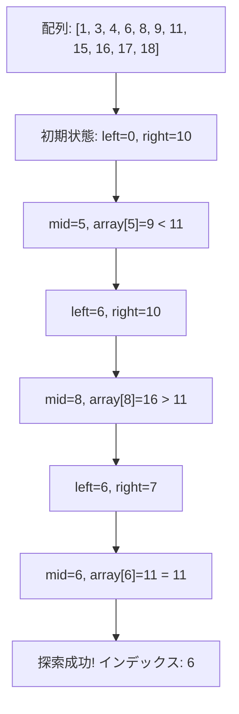

# 05補足_二分探索入門

## 二分探索をゼロから完全に理解する

この教材は、「二分探索」について全く知識がない方向けに、基礎から丁寧に解説します。実生活での例えを交えながら、直感的に理解できるよう心がけています。

## 目次

1. [二分探索とは何か](#1-二分探索とは何か)
2. [日常生活の例で理解する](#2-日常生活の例で理解する)
3. [二分探索の基本アルゴリズム](#3-二分探索の基本アルゴリズム)
4. [Pythonでの実装](#4-pythonでの実装)
5. [二分探索の応用](#5-二分探索の応用)
6. [答えを二分探索する手法](#6-答えを二分探索する手法)
7. [問題の解説：最適な郵便局の位置](#7-問題の解説最適な郵便局の位置)
8. [二分探索の実装テクニック](#8-二分探索の実装テクニック)
9. [練習問題](#9-練習問題)
10. [まとめ](#10-まとめ)

---

## 1. 二分探索とは何か

### 二分探索の基本概念

**二分探索（Binary Search）**は、**ソート済みの配列**から目的の値を効率良く探すアルゴリズムです。その名前の通り、探索範囲を半分ずつ絞り込んでいくことで、非常に高速に目的の値を見つけることができます。

二分探索の基本的な考え方は「**半分に分けて、どちらかを選ぶ**」というシンプルなものです。例えば、1から100までの数字の中から特定の数字を当てる「数当てゲーム」を考えてみましょう。

一般的なアプローチ（線形探索）では、「1ですか？ 2ですか？...」と順番に聞いていくため、最悪の場合は100回の質問が必要です。

しかし二分探索では、まず「50より大きいですか？」と聞き、答えによって探索範囲を半分に絞ります。これを繰り返すことで、たった7回ほどの質問で正解にたどり着けます（log₂(100) ≈ 6.64）。

### 二分探索が使える条件

二分探索を使うためには、探索対象が**ソートされている**必要があります。これは、「中間の値と比較して、探索範囲を半分に絞る」という操作が成立するためです。

また、探索対象には**順序関係**（大小関係）が定義されている必要があります。数値だけでなく、例えば辞書順で比較できる文字列なども二分探索の対象になります。

---

## 2. 日常生活の例で理解する

### 例1：辞書で単語を探す

辞書で単語を探す時の方法を思い出してください。まず、辞書をほぼ真ん中で開きます。

1. 開いたページの単語が探している単語より前にある場合は、後ろ半分を見ます。
2. 開いたページの単語が探している単語より後にある場合は、前半分を見ます。
3. 開いたページに目的の単語があれば、探索完了です。

この方法で、1,000ページの辞書からでも約10回のページめくりで目的の単語に到達できます。

### 例2：ビルの階数当て

100階建てのビルで、あるボタンを押すとそのフロアにいるかどうかがわかるエレベーターがあると想像してください。あなたは今どの階にいるでしょうか？

最適な戦略は、まず50階でボタンを押します。
- 50階より上にいることがわかれば、次は75階でボタンを押します。
- 50階より下にいることがわかれば、次は25階でボタンを押します。

このように半分ずつ範囲を狭めていくと、最大でも7回程度のボタン操作で正確な階数がわかります。

### 例3：高い・低いカードゲーム

トランプの「高い・低い」ゲームも二分探索の例です。1から13までの数字のカードが出されていて、次に出るカードが「高い」か「低い」かを当てるゲームです。最適な戦略は、常に「7」を基準に考えることです。

---

## 3. 二分探索の基本アルゴリズム

### アルゴリズムのステップ

二分探索の基本的なアルゴリズムは以下の通りです：

1. 探索範囲の左端を `left`、右端を `right` とします。
2. `left` ≤ `right` の間、以下を繰り返します：
   a. 中間点 `mid` = ⌊(`left` + `right`) / 2⌋ を計算します。
   b. `array[mid]` が探している値と一致すれば、探索成功です。
   c. `array[mid]` が探している値より小さければ、`left` = `mid + 1` として探索範囲を右半分に絞ります。
   d. `array[mid]` が探している値より大きければ、`right` = `mid - 1` として探索範囲を左半分に絞ります。
3. `left` > `right` になれば、探している値は配列に存在しません。

### 二分探索の動作例

ソート済み配列 `[1, 3, 4, 6, 8, 9, 11, 15, 16, 17, 18]` から値 `11` を探す場合：

1. 初期状態: `left` = 0, `right` = 10
2. `mid` = (0 + 10) / 2 = 5, `array[5]` = 9 < 11 なので、`left` = 6
3. `mid` = (6 + 10) / 2 = 8, `array[8]` = 16 > 11 なので、`right` = 7
4. `mid` = (6 + 7) / 2 = 6, `array[6]` = 11 = 11 なので、探索成功！



### 時間計算量

二分探索の時間計算量は **O(log n)** です。これは、探索範囲が毎回半分になるため、最悪でも log₂(n) 回の比較で結果が得られるからです。

例えば、10億個（10^9）の要素を持つ配列でも、最大で約30回（log₂(10^9) ≈ 29.9）の比較で目的の値を見つけられます。これは線形探索の O(n) と比べて非常に効率的です。

---

## 4. Pythonでの実装

### 基本的な二分探索の実装

```python
def binary_search(arr, target):
    """
    ソート済み配列arrから値targetを二分探索で探す
    見つかればインデックスを、見つからなければ-1を返す
    """
    left = 0
    right = len(arr) - 1
    
    while left <= right:
        mid = (left + right) // 2
        
        if arr[mid] == target:
            return mid  # 見つかった
        elif arr[mid] < target:
            left = mid + 1  # 右半分を探索
        else:
            right = mid - 1  # 左半分を探索
    
    return -1  # 見つからなかった

# 使用例
arr = [1, 3, 4, 6, 8, 9, 11, 15, 16, 17, 18]
print(binary_search(arr, 11))  # 出力: 6
print(binary_search(arr, 7))   # 出力: -1
```

### Pythonの標準ライブラリ（bisect）を使う方法

Pythonには二分探索のための標準ライブラリ `bisect` があります：

```python
import bisect

def binary_search_bisect(arr, target):
    """
    bisectライブラリを使った二分探索
    """
    index = bisect.bisect_left(arr, target)
    if index < len(arr) and arr[index] == target:
        return index
    return -1  # 見つからなかった

# 使用例
arr = [1, 3, 4, 6, 8, 9, 11, 15, 16, 17, 18]
print(binary_search_bisect(arr, 11))  # 出力: 6
print(binary_search_bisect(arr, 7))   # 出力: -1
```

`bisect` モジュールの主な関数：

- `bisect.bisect_left(a, x)`: ソート順序を保ったままxを挿入できる一番左の位置を返す
- `bisect.bisect_right(a, x)` または `bisect.bisect(a, x)`: ソート順序を保ったままxを挿入できる一番右の位置を返す
- `bisect.insort_left(a, x)`: ソート順序を保ったままxを挿入する
- `bisect.insort_right(a, x)` または `bisect.insort(a, x)`: ソート順序を保ったままxを挿入する

### 再帰を使った実装

再帰関数を使った実装もできます：

```python
def binary_search_recursive(arr, target, left=None, right=None):
    """
    再帰を使った二分探索
    """
    if left is None:
        left = 0
    if right is None:
        right = len(arr) - 1
        
    if left > right:
        return -1  # 見つからなかった
    
    mid = (left + right) // 2
    
    if arr[mid] == target:
        return mid  # 見つかった
    elif arr[mid] < target:
        return binary_search_recursive(arr, target, mid + 1, right)
    else:
        return binary_search_recursive(arr, target, left, mid - 1)
```

---

## 5. 二分探索の応用

### 下限と上限の検索

ソート済み配列において、特定の値以上（または以下）の最初の要素を見つけたい場合があります。これは `bisect_left` と `bisect_right` を使って実現できます。

```python
import bisect

def find_lower_bound(arr, target):
    """targetより小さくない最初の要素のインデックスを返す"""
    return bisect.bisect_left(arr, target)

def find_upper_bound(arr, target):
    """targetより大きい最初の要素のインデックスを返す"""
    return bisect.bisect_right(arr, target)

# 使用例
arr = [1, 3, 3, 5, 5, 5, 8, 9]
print(find_lower_bound(arr, 5))  # 出力: 3 (最初の5のインデックス)
print(find_upper_bound(arr, 5))  # 出力: 6 (最後の5の次のインデックス)
```

### 実数の二分探索（誤差処理）

整数だけでなく実数に対しても二分探索は適用できますが、浮動小数点の誤差に注意する必要があります：

```python
def binary_search_float(func, target, left, right, epsilon=1e-9):
    """
    連続関数funcにおいて、func(x)=targetとなるxを二分探索で求める
    epsilonは許容誤差
    """
    while right - left > epsilon:
        mid = (left + right) / 2
        if func(mid) < target:
            left = mid
        else:
            right = mid
    
    return (left + right) / 2

# 例: x^2 = 2 となる x（つまり√2）を求める
def square(x):
    return x * x

sqrt2 = binary_search_float(square, 2, 1, 2)
print(sqrt2)  # 出力: 約1.4142135623730951
```

---

## 6. 答えを二分探索する手法

### 判定問題への変換

二分探索は「値を探す」だけでなく、「最適な答えを探す」場合にも応用できます。この手法は「**答えで二分探索**」や「**二分法**」と呼ばれます。

具体的な手順は以下の通りです：

1. 解の範囲（最小値と最大値）を設定する
2. その範囲の中央の値が条件を満たすかどうかをチェックする
3. 条件を満たす場合、より良い解を探すために範囲を更新する
4. 条件を満たさない場合、別の範囲を探す
5. 十分に精度が高くなるまで2-4を繰り返す

### 例：K番目に小さい値を求める

2つのソート済み配列 A と B があり、この2つの配列をマージしたときの K 番目に小さい値を求める問題を考えます：

```python
def find_kth_smallest(A, B, k):
    """
    ソート済み配列AとBをマージしたときのK番目に小さい値を求める
    """
    def count_less_equal(x):
        """A, Bでx以下の要素の個数を返す"""
        count = 0
        count += bisect.bisect_right(A, x)
        count += bisect.bisect_right(B, x)
        return count
    
    left = min(A[0] if A else float('inf'), B[0] if B else float('inf'))
    right = max(A[-1] if A else float('-inf'), B[-1] if B else float('-inf'))
    
    while left < right:
        mid = (left + right) // 2
        if count_less_equal(mid) < k:
            left = mid + 1
        else:
            right = mid
    
    return left
```

### 例：最大の最小値問題

N個の要素を連続するM個のグループに分割するとき、各グループの和の最大値を最小化する問題を考えます：

```python
def min_max_group_sum(arr, m):
    """
    配列arrをm個のグループに分割するとき、
    各グループの和の最大値を最小化する
    """
    def can_split(max_sum):
        """
        各グループの和がmax_sum以下になるように
        m個以下のグループに分割できるか
        """
        count = 1
        current_sum = 0
        
        for num in arr:
            if current_sum + num > max_sum:
                count += 1
                current_sum = num
                if count > m:
                    return False
            else:
                current_sum += num
        
        return True
    
    left = max(arr)  # 各グループの和の最小値は、最大の要素以上
    right = sum(arr)  # 各グループの和の最大値は、全体の和
    
    while left < right:
        mid = (left + right) // 2
        if can_split(mid):
            right = mid
        else:
            left = mid + 1
    
    return left
```

---

## 7. 問題の解説：最適な郵便局の位置

### 問題文

```
問題:
N個の都市があり、都市iの座標はX_iです。
あなたは1つの郵便局を座標Pに建設しようとしています。
すべての都市から郵便局までの距離の最大値を最小化するような座標Pを求め、
そのときの最大距離を出力してください。

入力:
1行目: 都市の数 N
2行目: N個の都市の座標 X_1, X_2, ..., X_N

出力:
最適な郵便局の位置における最大距離
```

### 解法1：中央値を使う方法

この問題は、「すべての都市から郵便局までの距離の最大値を最小化する」というものです。実は、1次元上で最適な郵便局の位置は**都市の座標の中央値**となります。

```python
def solve():
    # 入力を受け取る
    N = int(input())
    X = list(map(int, input().split()))
    
    # ソート
    X.sort()
    
    # 中央値が最適解
    if N % 2 == 1:
        # 奇数の場合
        P = X[N//2]
    else:
        # 偶数の場合
        P = (X[N//2 - 1] + X[N//2]) / 2
    
    # 最大距離を計算
    max_distance = max(abs(P - X[0]), abs(P - X[-1]))
    
    print(max_distance)
```

### なぜ中央値が最適なのか

1次元上で点の集合からの最大距離を最小化する位置が中央値になる理由を直感的に説明します：

郵便局を極端に左や右に置くと、反対側の都市との距離が大きくなります。郵便局を少しずつ中央に近づけると、最も遠い都市との距離は小さくなります。最終的に、すべての都市を「左側のグループ」と「右側のグループ」に均等に分けたときに最適になります。これが中央値の位置です。

### 解法2：二分探索を使う方法

別の解法として、二分探索を使って最適な位置を求めることもできます：

```python
def solve_binary_search():
    # 入力を受け取る
    N = int(input())
    X = list(map(int, input().split()))
    
    # 探索範囲
    left = min(X)
    right = max(X)
    
    # 精度
    epsilon = 1e-9
    
    while right - left > epsilon:
        mid1 = left + (right - left) / 3
        mid2 = right - (right - left) / 3
        
        # 各位置での最大距離を計算
        dist1 = max_distance(X, mid1)
        dist2 = max_distance(X, mid2)
        
        if dist1 > dist2:
            left = mid1
        else:
            right = mid2
    
    # 最適な位置と最大距離
    P = (left + right) / 2
    result = max_distance(X, P)
    
    print(result)

def max_distance(X, P):
    """座標Pと都市Xの間の最大距離を計算"""
    return max(abs(P - x) for x in X)
```

この解法では、三分探索という手法を使っています。関数が単峰性（一つの極値を持つ）を持つときに効率的に最小値を見つけられます。

---

## 8. 二分探索の実装テクニック

### オーバーフロー対策

中間点 `mid` を計算するとき、単純に `(left + right) / 2` とすると、`left` と `right` が大きい場合にオーバーフローの可能性があります：

```python
# オーバーフローの可能性がある計算
mid = (left + right) // 2

# オーバーフローを回避する計算
mid = left + (right - left) // 2
```

### 浮動小数点数の誤差対策

浮動小数点数で二分探索を行う場合、等値比較をする代わりに誤差範囲を指定します：

```python
# 浮動小数点数の二分探索
def binary_search_float(func, target, left, right, epsilon=1e-9):
    while right - left > epsilon:  # 誤差範囲
        mid = (left + right) / 2
        if func(mid) < target:
            left = mid
        else:
            right = mid
    return (left + right) / 2
```

### 無限ループの回避

二分探索で無限ループに陥らないように注意しましょう：

```python
# 潜在的な無限ループ
while left < right:
    mid = (left + right) // 2
    if condition(mid):
        right = mid  # midを含む範囲に更新
    else:
        left = mid   # midを含む範囲に更新

# 安全な実装
while left < right:
    mid = (left + right) // 2
    if condition(mid):
        right = mid  # midを含む範囲に更新
    else:
        left = mid + 1  # midを除外した範囲に更新
```

---

## 9. 練習問題

### 問題1: 配列内の要素検索

**問題**：
整数の配列 `arr` と整数 `target` が与えられます。配列内に `target` が存在する場合はそのインデックスを、存在しない場合は `-1` を返してください。配列はソート済みです。

**入力例**：
```
10
1 3 5 7 9 11 13 15 17 19
7
```

**出力例**：
```
3
```

### 問題2: 平方根の計算

**問題**：
正の整数 `n` が与えられます。`n` の平方根を小数点以下6桁まで求めてください。ただし、`sqrt()` 関数は使用せず、二分探索で解いてください。

**入力例**：
```
2
```

**出力例**：
```
1.414214
```

### 問題3: 最小の船の大きさ

**問題**：
`N` 個の荷物があり、それぞれの重さは `weights[i]` です。これらの荷物を `D` 日以内に運ぶために、1日に1往復だけできる船を用意します。船の容量を最小にしたいとき、必要な船の容量を求めてください。

**入力例**：
```
4 3
1 2 3 4
```

**出力例**：
```
4
```

---

## 10. まとめ

### 二分探索のポイント

1. **ソート済み配列に適用できる**：配列がソート済みでない場合は、まずソートする必要があります。
2. **O(log n)の時間計算量**：非常に大きな配列でも高速に検索できます。
3. **実数にも適用できる**：誤差に注意すれば、実数の問題にも応用可能です。
4. **答えで二分探索**：最適な値を探す問題にも応用できます。

### 二分探索の利点と注意点

**利点**：
- 非常に高速な検索が可能
- 単純なアルゴリズムで実装しやすい
- 様々な問題に応用可能

**注意点**：
- ソート済みであることが前提
- 無限ループに注意
- 浮動小数点の誤差に注意
- 等号の扱い（<= vs <）に注意

### これからの学習ポイント

1. 標準ライブラリ `bisect` の活用
2. 三分探索など、関連するテクニックの学習
3. 様々なタイプの「答えで二分探索」問題の練習
4. 二分探索と他のアルゴリズムの組み合わせ

二分探索は、効率的なアルゴリズムの基本として、競技プログラミングだけでなく実際のソフトウェア開発でも頻繁に使われます。基本をしっかり理解し、様々な問題に応用できるようになりましょう！
